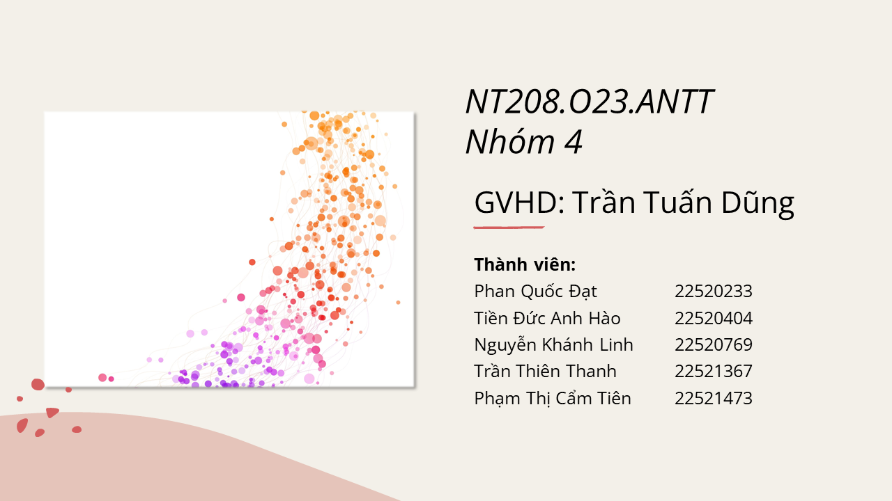
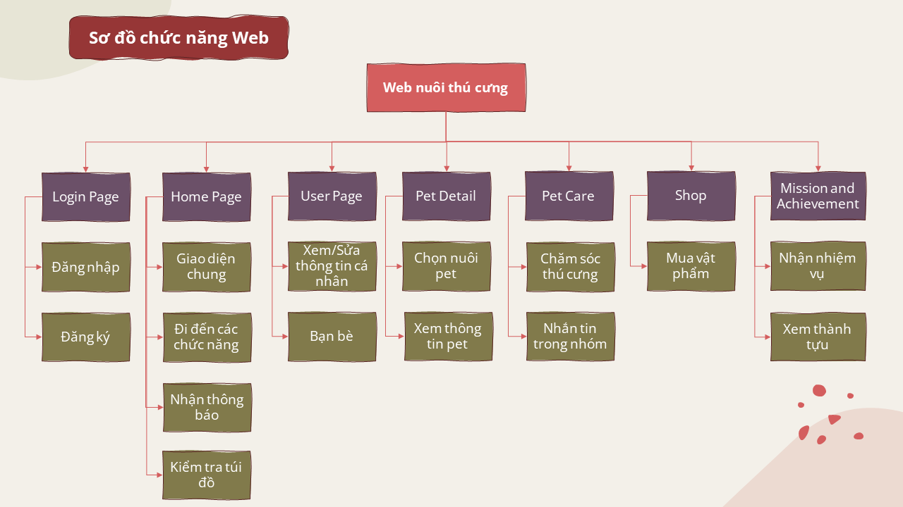
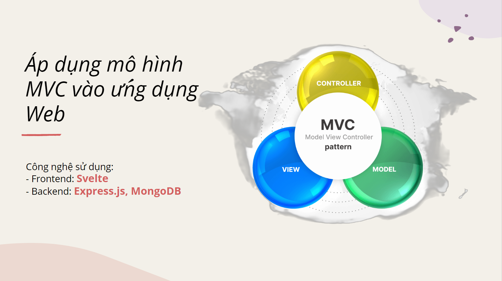
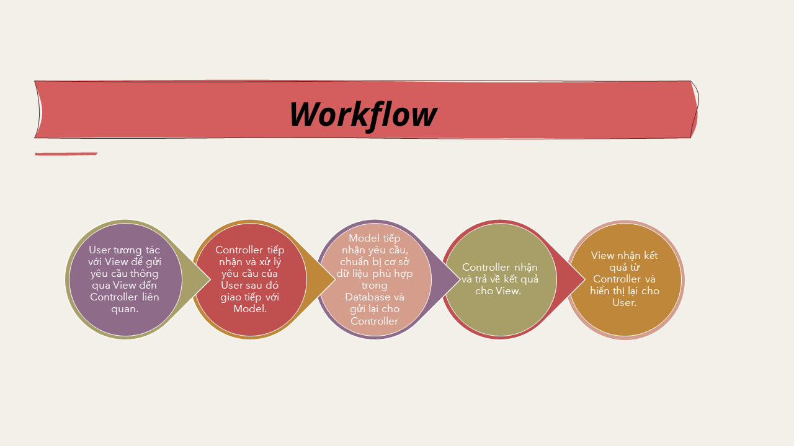
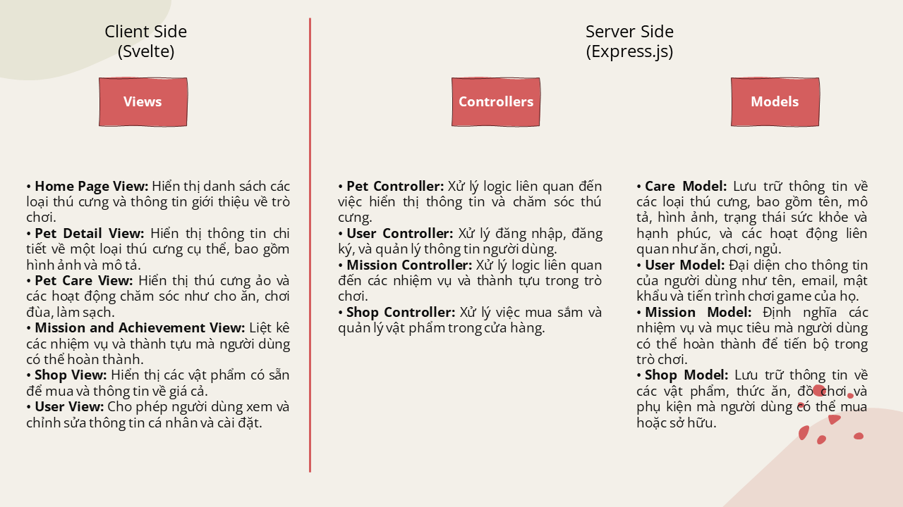
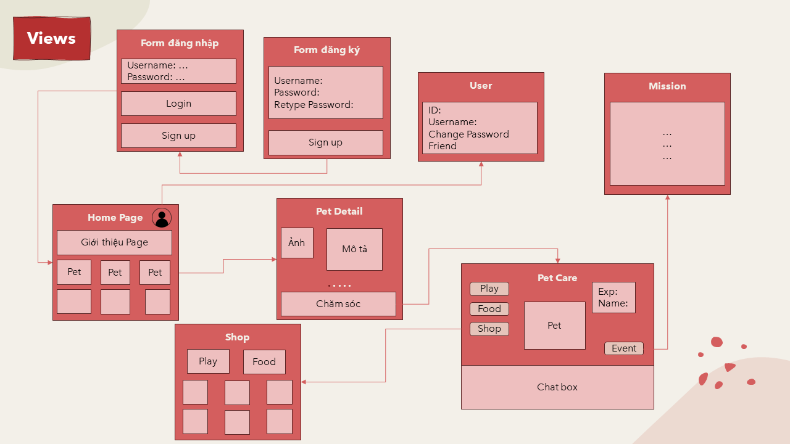
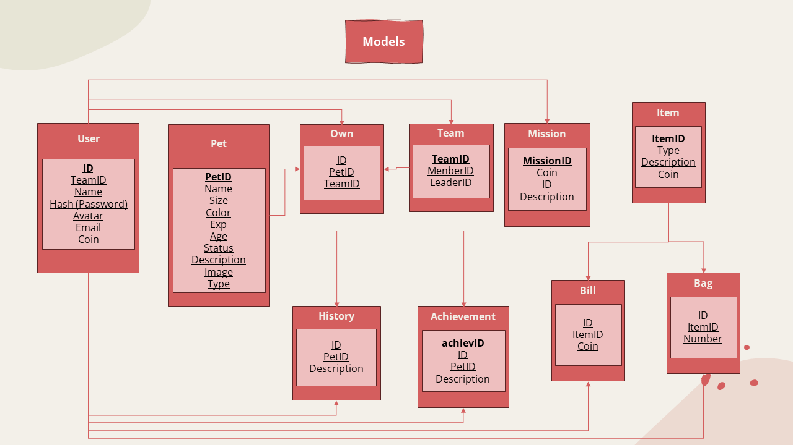
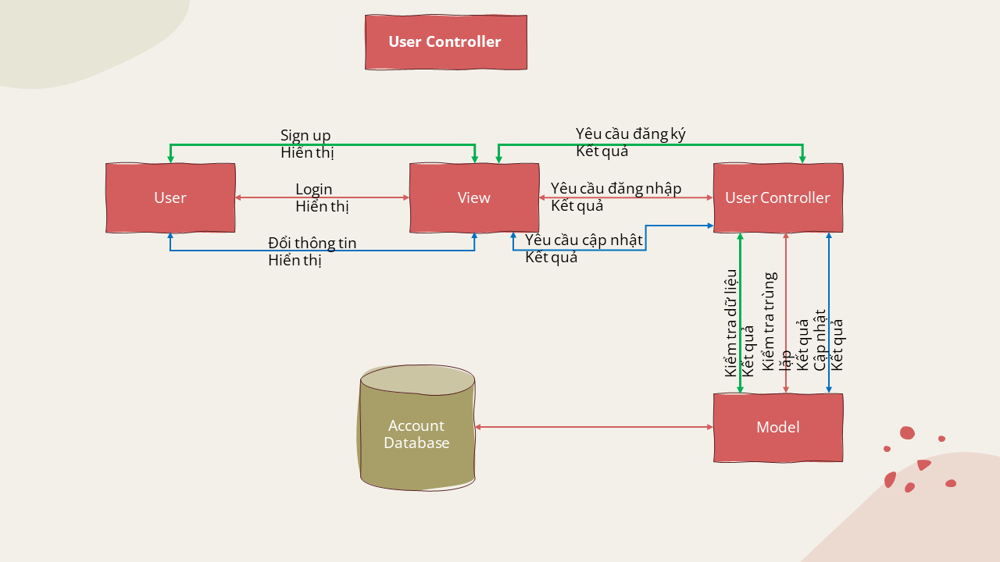
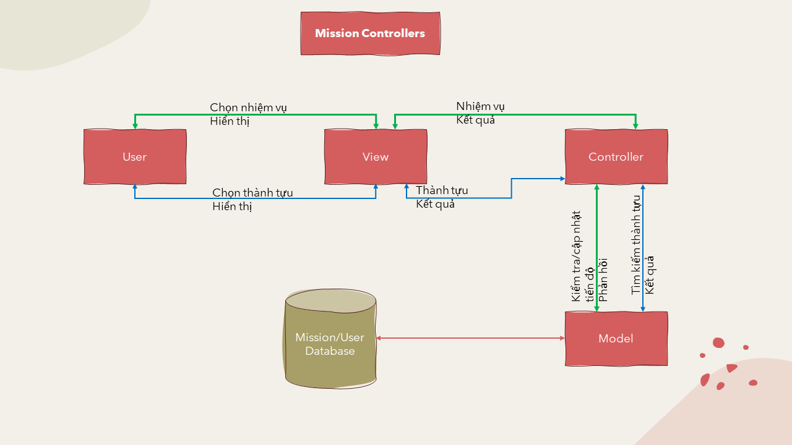
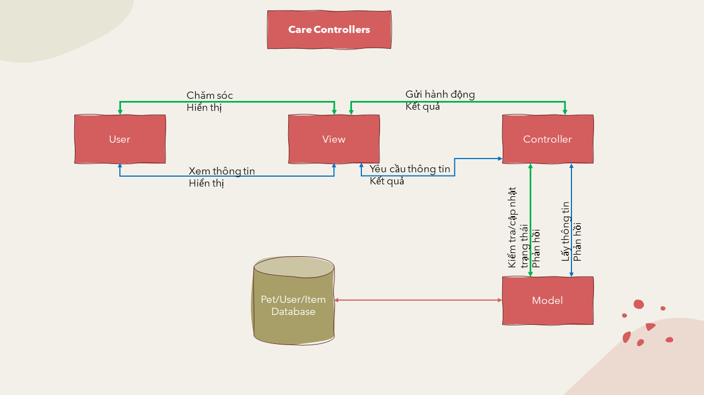

# **Đồ án môn học: Lập trình Ứng dụng Web**

## Giới thiệu thành viên

## Giới thiệu đề tài
>Tên đề tài: ***Ứng dụng web nuôi thú cưng***

>Mô tả đề tài: "Ứng dụng web nuôi thú cưng" là một nền tảng trực tuyến được thiết kế để cung cấp trải nghiệm nuôi thú cưng trong môi trường web. Ứng dụng này cho phép người dùng lựa chọn và tùy chỉnh loài thú cưng ảo mà họ muốn nuôi. Ứng dụng có thể bao gồm các tính năng như lên cấp độ, thu thập điểm thưởng để mua đồ cho thú cưng, tham gia các hoạt động cộng đồng và giao tiếp với các người dùng khác để chia sẻ kinh nghiệm và kỷ niệm về việc nuôi thú cưng ảo.

## Sơ đồ chức năng web

## Công nghệ và mô hình sử dụng

## Workflow chung về mô hình MVC của nhóm

### Tổng quan về mô hình của nhóm 

## Chi tiết về mô hình MVC nhóm đã thiết kế
### View

### Model

### Controller

