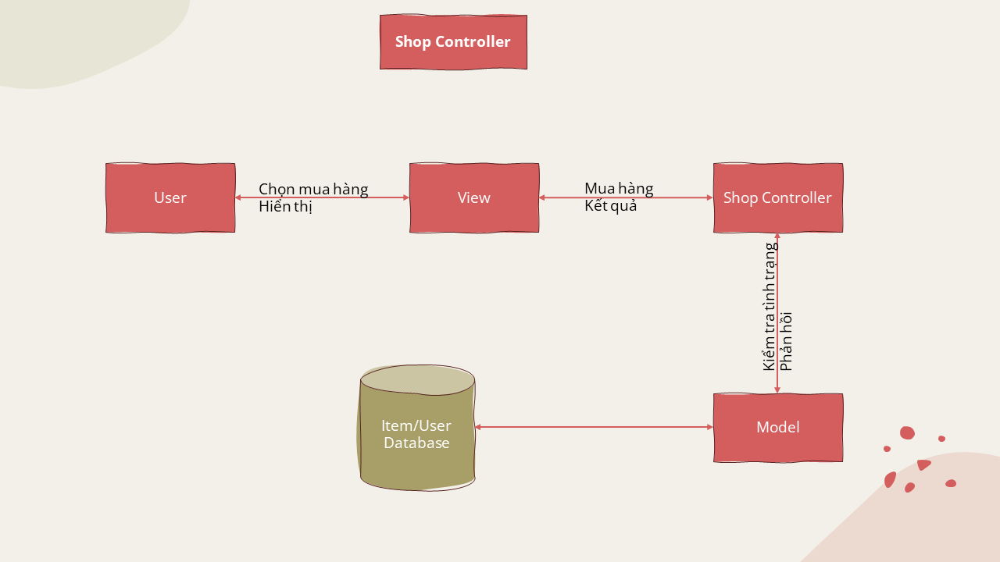

## Installation
To install and run this project, follow these steps:

1. Clone the repository:
  ```bash
  $ git clone git@github.com:haouit/NT208.O23.ANTT-Group-4.git PetCare
  ```

2. Navigate to the project directory:
  ```bash
  $ cd PetCare
  ```

3. Install the dependencies and start application:
  please open split terminal and run parallel
  For frontend:
  ```bash
  $ cd Frontend/
  $ npm i
  $ npm run dev
  ```
  For backend:
  ```bash
  $ cd Backend/
  $ npm i
  $ npm run dev
  ```

4. Create Backend/.env file contain ACCESS_TOKEN_SECRET and MONGO_URI, for example:
```
ACCESS_TOKEN_SECRET='your-access-token-secret'
MONGO_URI='mongodb+srv://your-mongo-database-uri'
```

5. Open your web browser and visit localhost following frontend's terminal to view the application.

That's it! You have successfully installed and run the project.

# **Đồ án môn học: Lập trình Ứng dụng Web**
## Mục lục
- [Giới thiệu thành viên](#giới-thiệu-thành-viên)
- [Giới thiệu đề tài](#giới-thiệu-đề-tài)
- [Sơ đồ chức năng web](#sơ-đồ-chức-năng-web)
- [Công nghệ và mô hình sử dụng](#công-nghệ-và-mô-hình-sử-dụng)
- [Workflow chung về mô hình MVC của nhóm](#workflow-chung-về-mô-hình-mvc-của-nhóm)
  - [Tổng quan về mô hình của nhóm](#tổng-quan-về-mô-hình-của-nhóm)
- [Chi tiết về mô hình MVC nhóm đã thiết kế](#chi-tiết-về-mô-hình-mvc-nhóm-đã-thiết-kế)
  - [View](#view)
  - [Model](#model)
  - [Controller](#controller)

## Giới thiệu thành viên


## Giới thiệu đề tài
> Tên đề tài: ***Ứng dụng web nuôi thú cưng***

> Mô tả đề tài: "Ứng dụng web nuôi thú cưng" là một nền tảng trực tuyến được thiết kế để cung cấp trải nghiệm nuôi thú cưng trong môi trường web. Ứng dụng này cho phép người dùng lựa chọn và tùy chỉnh loài thú cưng ảo mà họ muốn nuôi. Ứng dụng có thể bao gồm các tính năng như lên cấp độ, thu thập điểm thưởng để mua đồ cho thú cưng, tham gia các nhiệm vụ cùng với thú để thêm độ thân thiết và kỷ niệm về việc nuôi thú cưng ảo.

## Sơ đồ chức năng web


## Công nghệ và mô hình sử dụng


## Workflow chung về mô hình MVC của nhóm


### Tổng quan về mô hình của nhóm 


## Chi tiết về mô hình MVC nhóm đã thiết kế
### View

### Model

### Controller



